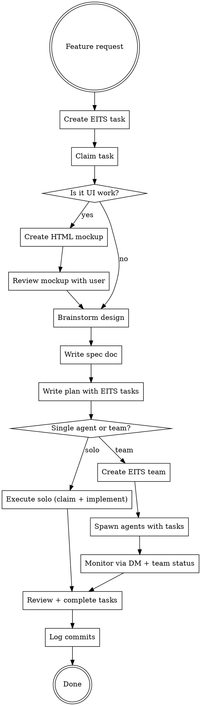

# EITS Superpowers

EITS-native development workflow. Replaces generic superpowers (TodoWrite-only tracking, untracked subagents) with EITS infrastructure: server-tracked tasks, team-based agent spawning, commit logging, and mockup-first UI design.

**Announce at start:** "Using EITS Superpowers for tracked development."

<HARD-GATE>
You MUST have a claimed EITS task before editing any files. The pre-tool-use hook enforces this.
</HARD-GATE>

## When to Use

Use this instead of bare superpowers skills when:
- Working in an EITS-tracked project (`$EITS_SESSION_UUID` is set)
- Building features that need task tracking beyond the current session
- Coordinating multiple agents (use EITS teams, not raw subagents)
- Building UI features (mockup-first approach)

## Workflow Overview



---

## Phase 1: Task Setup

Every piece of work starts with an EITS task. No exceptions.

```bash
# Create and claim atomically
eits tasks create --title "Feature: <name>" --description "<what and why>"
eits tasks claim <task_id>
```

The claim command transitions to in-progress, self-assigns, links your session, and sets team member status. The pre-tool-use hook will block file edits until this is done.

---

## Phase 2: Mockup-First UI Design

**For any work that touches the UI**, create an HTML mockup BEFORE writing backend or LiveView code. This is how the EITS project works; see `priv/static/mockups.html` for the established pattern.

### Mockup Structure

```html
<!DOCTYPE html>
<html lang="en">
<head>
  <meta charset="UTF-8" />
  <title><Feature Name> — Mockups</title>
  <style>
    /* Use the EITS dark theme variables */
    :root {
      --bg: #0f1117;
      --surface: #1a1d27;
      --surface2: #22263a;
      --border: #2e3348;
      --accent: #6366f1;
      --accent2: #818cf8;
      --text: #e2e8f0;
      --muted: #64748b;
      --green: #22c55e;
      --yellow: #f59e0b;
    }
    /* Include app chrome: sidebar, header, tabs */
    /* Include annotation blocks explaining behavior */
  </style>
</head>
<body>
  <!-- View tabs for switching between mockup states -->
  <!-- Mockup frames with app chrome -->
  <!-- Annotation blocks with implementation notes -->
</body>
</html>
```

### Mockup Checklist

1. Create `priv/static/mockups/<feature-name>.html`
2. Include view tabs for different states (list view, form view, mobile/desktop)
3. Use EITS dark theme variables consistently
4. Add annotation blocks (`<div class="annotation">`) explaining behavior and data sources
5. Include app chrome (sidebar, header) for context
6. Show both mobile (drawer) and desktop (modal) variants for forms
7. Open in browser for user review: `open priv/static/mockups/<feature-name>.html`

### Why Mockups First

- Catches layout and flow issues before writing a single line of Elixir/HEEx
- The HTML becomes a reference for the LiveView implementation
- Annotations document which contexts/queries power each section
- User reviews a real visual, not a text description

---

## Phase 3: Design + Spec

After mockup approval (or immediately for non-UI work), brainstorm the design.

Use the standard brainstorming process but with EITS additions:

1. Explore project context (code, docs, recent commits)
2. Ask clarifying questions (one at a time)
3. Propose 2-3 approaches with trade-offs
4. Present design; get user approval per section
5. Write spec to `docs/superpowers/specs/YYYY-MM-DD-<topic>-design.md`
6. Log the spec as an EITS note:

```bash
eits notes create \
  --parent-type session \
  --parent-id $EITS_SESSION_UUID \
  --body "Spec written: docs/superpowers/specs/<filename>.md -- <one-line summary>"
```

---

## Phase 4: Plan with EITS Tasks

Write the implementation plan following the standard writing-plans structure, but create EITS tasks for each major unit of work.

### Solo Execution (single agent)

For work you will do yourself:

```bash
# Create tasks for each plan chunk
eits tasks create --title "Task 1: <component>" --description "Files: ... Steps: ..."
eits tasks create --title "Task 2: <component>" --description "Files: ... Steps: ..."

# Claim and work them sequentially
eits tasks claim <task_1_id>
# ... implement ...
eits tasks complete <task_1_id> --message "Implemented <component>, tests passing"

eits tasks claim <task_2_id>
# ... implement ...
eits tasks complete <task_2_id> --message "Implemented <component>, tests passing"
```

### Team Execution (multiple agents)

For work that can be parallelized, use the EITS teams workflow. See `references/team-execution.md` for the full protocol.

**Decision criteria:**
- 1-2 independent tasks with clear boundaries -> solo
- 3+ independent tasks or tasks needing different expertise -> team
- Tightly coupled tasks that share state -> solo (sequential)

---

## Phase 5: Implementation

### TDD Cycle (per task)

Follow TDD regardless of solo or team execution:

1. Write failing test
2. Verify it fails
3. Implement minimal code
4. Verify it passes
5. Refactor if needed
6. Commit

### Compile Check

Before marking any task complete:

```bash
mix compile --warnings-as-errors
```

### Commit Logging

After each commit, log it in EITS:

```bash
HASH=$(git rev-parse HEAD)
eits commits create --hash $HASH
```

---

## Phase 6: Completion

### Task Completion Sequence

```bash
# Complete the task (annotates + marks done + DMs team lead)
eits tasks complete <task_id> --message "Summary of work"
```

### Session Note

Log a summary note on the session:

```bash
eits notes create \
  --parent-type session \
  --parent-id $EITS_SESSION_UUID \
  --body "Completed: <feature name>. Tasks: <ids>. Commits: <hashes>."
```

---

## Integration with Superpowers Skills

This skill wraps and extends these superpowers skills:

| Phase | Superpowers skill | EITS addition |
|-------|-------------------|---------------|
| Design | `superpowers:brainstorming` | Mockup-first for UI; EITS notes for specs |
| Plan | `superpowers:writing-plans` | EITS tasks per plan chunk |
| Execute (solo) | `superpowers:executing-plans` | EITS task claim/complete per chunk |
| Execute (team) | `superpowers:subagent-driven-development` | EITS teams + agent spawning |
| Debug | `superpowers:systematic-debugging` | EITS task for the bug |
| Review | `superpowers:requesting-code-review` | Review via EITS team reviewer agent |
| Finish | `superpowers:finishing-a-development-branch` | Commit logging via `eits commits create` |
| Verify | `superpowers:verification-before-completion` | `mix compile --warnings-as-errors` |

**Invoke the underlying superpowers skill for process discipline.** This skill adds EITS tracking on top; it does not replace the process rigor.

---

## Red Flags

| Thought | Reality |
|---------|---------|
| "I'll track this in TodoWrite only" | Use EITS tasks; they persist across sessions |
| "I'll spawn a raw subagent" | Use EITS teams; spawned agents get session tracking |
| "Mockup is not needed for this UI change" | If it touches the UI, mockup first |
| "I'll commit without logging" | Always `eits commits create` after commits |
| "I'll skip the task and just edit" | The hook will block you; claim a task first |
| "This is too small for EITS tracking" | Small tasks still need tracking; use `eits tasks quick` |

---

## Quick Reference

```bash
# Task lifecycle
eits tasks create --title "..." --description "..."
eits tasks claim <id>
eits tasks complete <id> --message "..."

# Notes
eits notes create --parent-type session --parent-id $EITS_SESSION_UUID --body "..."

# Commits
eits commits create --hash $(git rev-parse HEAD)

# Teams (see references/team-execution.md)
eits teams create --name "..." --description "..."
eits agents spawn --instructions "..." --team-name "..." --member-name "..."
eits teams status <team_id>
eits dm --to <session_uuid> --message "..."
```
